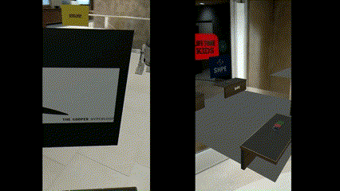

A prototype smartphone application demonstrating colocation capabilities in augmented reality using Unity AR Foundation and Photon Networking. I developed this during 2020 COVID-19 quarantine. Users scan their local environment and then log into a virtual space with other users. All users present in the virtual space are represented by a 3D avatar; in this case, I used a static model of R2-D2. Photon captures their physical movement and updates their AR avatar positions so that users can move around the virtual area and interact with other users in augmented reality.

Initial Demo Reel: https://www.youtube.com/watch?v=aEnK87qk_nA

Test case scenario for a virtual college club fair: https://www.youtube.com/watch?v=ybV6hrg6dlM

Demo of two users in different physical rooms but the same virtual space:

